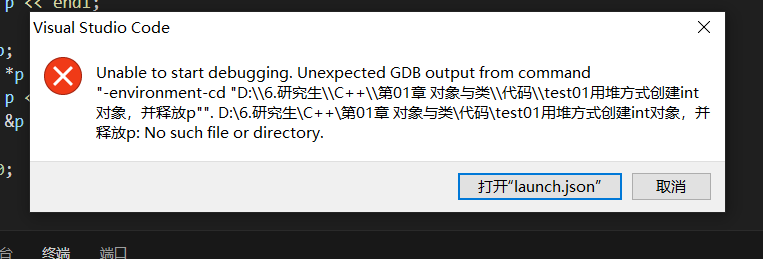

# Random Note For Solutions

## 23.10.10
#### When debugging in vs code, it may shows like this.**

This is because the folders' names must not be Chinese, MinGw does not support Chinese path.

#### `<iostream.h>` and `void main` are not supported now, we use  

    #include<iostream>
    using namespace std;

and `int main`

